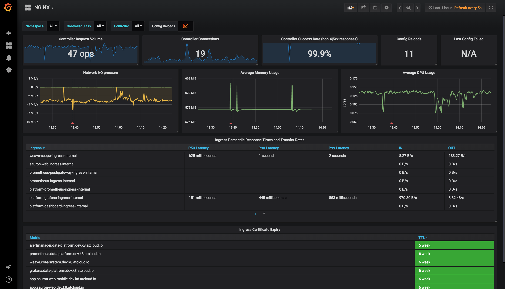
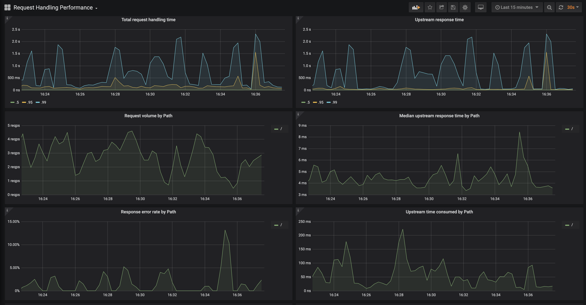

# Monitoring

The ingress-nginx-neo controller exposes [Prometheus](https://prometheus.io/) metrics on port `10254` (path `/metrics`).
This page describes how to make Prometheus scrape these metrics and how to visualize them with the
[Grafana](https://grafana.com/) dashboards that are part of this repository.

The chart does not install Prometheus or Grafana. Install them with the instructions of their own projects, for example:

- [Prometheus installation](https://prometheus.io/docs/prometheus/latest/installation/) and the
  [Prometheus Operator](https://prometheus-operator.dev/docs/getting-started/installation/);
- [Grafana installation](https://grafana.com/docs/grafana/latest/setup-grafana/installation/);
- the [kube-prometheus-stack](https://artifacthub.io/packages/helm/prometheus-community/kube-prometheus-stack) Helm chart,
  which installs the Prometheus Operator, Prometheus, Alertmanager and Grafana together.

The examples below assume that the controller is installed with the Helm chart as described in the
[installation guide](../deploy/index.md), with the release name `ingress-nginx-neo` in the namespace `ingress-nginx-neo`.

## Enable metrics in the controller

Metrics are disabled by default. The chart value `controller.metrics.enabled=true` passes `--enable-metrics=true` to the
controller, exposes the `metrics` container port and creates the Service `ingress-nginx-neo-controller-metrics`
(port `10254`).

Choose how Prometheus discovers the metrics endpoint:

- with a `ServiceMonitor` (Prometheus Operator, kube-prometheus-stack): `controller.metrics.serviceMonitor.enabled=true`;
- with the `prometheus.io/*` scrape annotations (Prometheus configured with Kubernetes service discovery and
  annotation-based relabeling): `controller.podAnnotations`.

### Using a ServiceMonitor

```console
helm upgrade ingress-nginx-neo oci://ghcr.io/kuzmenko-pavel/ingress-nginx-neo/charts/ingress-nginx-neo \
  --namespace ingress-nginx-neo \
  --reuse-values \
  --set controller.metrics.enabled=true \
  --set controller.metrics.serviceMonitor.enabled=true \
  --set controller.metrics.serviceMonitor.additionalLabels.release="prometheus"
```

The equivalent values file:

```yaml
controller:
  metrics:
    enabled: true
    serviceMonitor:
      enabled: true
      additionalLabels:
        release: prometheus
```

`controller.metrics.serviceMonitor.additionalLabels` must match the `serviceMonitorSelector` of your Prometheus instance.
With kube-prometheus-stack the default selector is the label `release: <kube-prometheus-stack release name>`
(`prometheus` in the example above).

When Prometheus runs in another namespace and must discover ServiceMonitors from all namespaces, configure
kube-prometheus-stack accordingly:

```yaml
prometheus:
  prometheusSpec:
    podMonitorSelectorNilUsesHelmValues: false
    serviceMonitorSelectorNilUsesHelmValues: false
```

Other ServiceMonitor settings (scrape interval, namespace, relabelings) and a `PrometheusRule` with alerting rules
(`controller.metrics.prometheusRule`) are configurable through the chart values; run
`helm show values oci://ghcr.io/kuzmenko-pavel/ingress-nginx-neo/charts/ingress-nginx-neo` for the full list.

### Using Prometheus scrape annotations

```console
helm upgrade ingress-nginx-neo oci://ghcr.io/kuzmenko-pavel/ingress-nginx-neo/charts/ingress-nginx-neo \
  --namespace ingress-nginx-neo \
  --reuse-values \
  --set controller.metrics.enabled=true \
  --set-string controller.podAnnotations."prometheus\.io/scrape"="true" \
  --set-string controller.podAnnotations."prometheus\.io/port"="10254"
```

The equivalent values file:

```yaml
controller:
  metrics:
    enabled: true
  podAnnotations:
    prometheus.io/scrape: "true"
    prometheus.io/port: "10254"
```

The annotations only take effect when your Prometheus scrape configuration uses them
(see the Prometheus [`kubernetes_sd_config`](https://prometheus.io/docs/prometheus/latest/configuration/configuration/#kubernetes_sd_config)
documentation).

### Verify the configuration

Check the values of the installed release:

```console
helm get values ingress-nginx-neo --namespace ingress-nginx-neo
```

Check that the controller serves metrics:

```console
kubectl -n ingress-nginx-neo port-forward svc/ingress-nginx-neo-controller-metrics 10254:10254
curl -s http://127.0.0.1:10254/metrics | grep nginx_ingress_controller_config_last_reload_successful
```

In the Prometheus UI, the controller pods appear as targets under *Status* → *Targets*, and the query
`nginx_ingress_controller_config_hash` returns one series per controller pod.

## Grafana dashboards

Two Grafana dashboards are available in the repository under
[`docs/dashboards`](https://github.com/Kuzmenko-Pavel/ingress-nginx-neo/tree/main/docs/dashboards). Both require
**Grafana v10.4.3** (or newer) and a Prometheus data source.

### NGINX Ingress controller

JSON: [`docs/dashboards/nginx.json`](https://github.com/Kuzmenko-Pavel/ingress-nginx-neo/blob/main/docs/dashboards/nginx.json)



- Filtering by Namespace, Controller Class and Controller
- Request volume, connections, success rates, config reloads and configs out of sync
- Network IO pressure, memory and CPU use
- Ingress P50, P95 and P99 percentile response times with IN/OUT throughput
- SSL certificate expiry
- Annotation overlays that show when config reloads happened

### Request Handling Performance

JSON: [`docs/dashboards/request-handling-performance.json`](https://github.com/Kuzmenko-Pavel/ingress-nginx-neo/blob/main/docs/dashboards/request-handling-performance.json)



- Filtering by Ingress
- P50, P95 and P99 percentile of total request and upstream response times
- Request volume by path
- Error volume and error rate by path
- Average response time by path

### Import a dashboard

1. In Grafana, add a Prometheus data source that points to your Prometheus server (*Connections* → *Data sources*),
   if it does not exist yet.
2. Open *Dashboards* → *New* → *Import*.
3. Upload the JSON file, or paste its content, for example from
   `https://raw.githubusercontent.com/Kuzmenko-Pavel/ingress-nginx-neo/main/docs/dashboards/nginx.json`.
4. Select the Prometheus data source and click *Import*.

With kube-prometheus-stack, dashboards can also be provisioned automatically by the Grafana dashboard sidecar: store the
JSON in a ConfigMap with the label `grafana_dashboard: "1"`. See the
[Grafana Helm chart documentation](https://github.com/grafana/helm-charts/tree/main/charts/grafana#sidecar-for-dashboards)
for details.

## Caveats

### Wildcard ingresses

By default request metrics are labeled with the hostname. When you have a wildcard domain ingress, there are no metrics
for that ingress (to prevent the metrics from exploding in cardinality). To get metrics in this case you have two options:

- Run the ingress controller with `--metrics-per-host=false`. You lose labeling by hostname, but still have labeling by ingress.
- Run the ingress controller with `--metrics-per-undefined-host=true --metrics-per-host=true`. You get labeling by
  hostname even if the hostname is not explicitly defined on an ingress. Be warned that cardinality could explode due to
  many hostnames and CPU usage could also increase.

With the chart, pass these flags through `controller.extraArgs`, for example
`--set controller.extraArgs.metrics-per-host=false`.

## Exposed metrics

Prometheus metrics are exposed on port 10254.

### Request metrics

* `nginx_ingress_controller_request_duration_seconds` Histogram\
  The request processing (time elapsed between the first bytes were read from the client and the log write after the last bytes were sent to the client) time in seconds (affected by client speed).\
  nginx var: `request_time`

* `nginx_ingress_controller_response_duration_seconds` Histogram\
  The time spent on receiving the response from the upstream server in seconds (affected by client speed when the response is bigger than proxy buffers).\
  Note: can be up to several millis bigger than the `nginx_ingress_controller_request_duration_seconds` because of the different measuring method.
  nginx var: `upstream_response_time`

* `nginx_ingress_controller_header_duration_seconds` Histogram\
  The time spent on receiving first header from the upstream server\
  nginx var: `upstream_header_time`

* `nginx_ingress_controller_connect_duration_seconds` Histogram\
  The time spent on establishing a connection with the upstream server\
  nginx var: `upstream_connect_time`

* `nginx_ingress_controller_response_size` Histogram\
  The response length (including request line, header, and request body)\
  nginx var: `bytes_sent`

* `nginx_ingress_controller_request_size` Histogram\
  The request length (including request line, header, and request body)\
  nginx var: `request_length`

* `nginx_ingress_controller_requests` Counter\
  The total number of client requests

* `nginx_ingress_controller_bytes_sent` Histogram\
  The number of bytes sent to a client. **Deprecated**, use `nginx_ingress_controller_response_size`\
  nginx var: `bytes_sent`

```
# HELP nginx_ingress_controller_bytes_sent The number of bytes sent to a client. DEPRECATED! Use nginx_ingress_controller_response_size
# TYPE nginx_ingress_controller_bytes_sent histogram
# HELP nginx_ingress_controller_connect_duration_seconds The time spent on establishing a connection with the upstream server
# TYPE nginx_ingress_controller_connect_duration_seconds nginx_ingress_controller_connect_duration_seconds
* HELP nginx_ingress_controller_header_duration_seconds The time spent on receiving first header from the upstream server
# TYPE nginx_ingress_controller_header_duration_seconds histogram
# HELP nginx_ingress_controller_request_duration_seconds The request processing time in milliseconds
# TYPE nginx_ingress_controller_request_duration_seconds histogram
# HELP nginx_ingress_controller_request_size The request length (including request line, header, and request body)
# TYPE nginx_ingress_controller_request_size histogram
# HELP nginx_ingress_controller_requests The total number of client requests.
# TYPE nginx_ingress_controller_requests counter
# HELP nginx_ingress_controller_response_duration_seconds The time spent on receiving the response from the upstream server
# TYPE nginx_ingress_controller_response_duration_seconds histogram
# HELP nginx_ingress_controller_response_size The response length (including request line, header, and request body)
# TYPE nginx_ingress_controller_response_size histogram
```


### Nginx process metrics
```
# HELP nginx_ingress_controller_nginx_process_connections current number of client connections with state {active, reading, writing, waiting}
# TYPE nginx_ingress_controller_nginx_process_connections gauge
# HELP nginx_ingress_controller_nginx_process_connections_total total number of connections with state {accepted, handled}
# TYPE nginx_ingress_controller_nginx_process_connections_total counter
# HELP nginx_ingress_controller_nginx_process_cpu_seconds_total Cpu usage in seconds
# TYPE nginx_ingress_controller_nginx_process_cpu_seconds_total counter
# HELP nginx_ingress_controller_nginx_process_num_procs number of processes
# TYPE nginx_ingress_controller_nginx_process_num_procs gauge
# HELP nginx_ingress_controller_nginx_process_oldest_start_time_seconds start time in seconds since 1970/01/01
# TYPE nginx_ingress_controller_nginx_process_oldest_start_time_seconds gauge
# HELP nginx_ingress_controller_nginx_process_read_bytes_total number of bytes read
# TYPE nginx_ingress_controller_nginx_process_read_bytes_total counter
# HELP nginx_ingress_controller_nginx_process_requests_total total number of client requests
# TYPE nginx_ingress_controller_nginx_process_requests_total counter
# HELP nginx_ingress_controller_nginx_process_resident_memory_bytes number of bytes of memory in use
# TYPE nginx_ingress_controller_nginx_process_resident_memory_bytes gauge
# HELP nginx_ingress_controller_nginx_process_virtual_memory_bytes number of bytes of memory in use
# TYPE nginx_ingress_controller_nginx_process_virtual_memory_bytes gauge
# HELP nginx_ingress_controller_nginx_process_write_bytes_total number of bytes written
# TYPE nginx_ingress_controller_nginx_process_write_bytes_total counter
```

### Controller metrics
```
# HELP nginx_ingress_controller_build_info A metric with a constant '1' labeled with information about the build.
# TYPE nginx_ingress_controller_build_info gauge
# HELP nginx_ingress_controller_check_success Cumulative number of Ingress controller syntax check operations
# TYPE nginx_ingress_controller_check_success counter
# HELP nginx_ingress_controller_config_hash Running configuration hash actually running
# TYPE nginx_ingress_controller_config_hash gauge
# HELP nginx_ingress_controller_config_last_reload_successful Whether the last configuration reload attempt was successful
# TYPE nginx_ingress_controller_config_last_reload_successful gauge
# HELP nginx_ingress_controller_config_last_reload_successful_timestamp_seconds Timestamp of the last successful configuration reload.
# TYPE nginx_ingress_controller_config_last_reload_successful_timestamp_seconds gauge
# HELP nginx_ingress_controller_ssl_certificate_info Hold all labels associated to a certificate
# TYPE nginx_ingress_controller_ssl_certificate_info gauge
# HELP nginx_ingress_controller_success Cumulative number of Ingress controller reload operations
# TYPE nginx_ingress_controller_success counter
# HELP nginx_ingress_controller_orphan_ingress Gauge reporting status of ingress orphanity, 1 indicates orphaned ingress. 'namespace' is the string used to identify namespace of ingress, 'ingress' for ingress name and 'type' for 'no-service' or 'no-endpoint' of orphanity
# TYPE nginx_ingress_controller_orphan_ingress gauge
```

### Admission metrics
```
# HELP nginx_ingress_controller_admission_config_size The size of the tested configuration
# TYPE nginx_ingress_controller_admission_config_size gauge
# HELP nginx_ingress_controller_admission_render_duration The processing duration of ingresses rendering by the admission controller (float seconds)
# TYPE nginx_ingress_controller_admission_render_duration gauge
# HELP nginx_ingress_controller_admission_render_ingresses The length of ingresses rendered by the admission controller
# TYPE nginx_ingress_controller_admission_render_ingresses gauge
# HELP nginx_ingress_controller_admission_roundtrip_duration The complete duration of the admission controller at the time to process a new event (float seconds)
# TYPE nginx_ingress_controller_admission_roundtrip_duration gauge
# HELP nginx_ingress_controller_admission_tested_duration The processing duration of the admission controller tests (float seconds)
# TYPE nginx_ingress_controller_admission_tested_duration gauge
# HELP nginx_ingress_controller_admission_tested_ingresses The length of ingresses processed by the admission controller
# TYPE nginx_ingress_controller_admission_tested_ingresses gauge
```

### Histogram buckets

You can configure buckets for histogram metrics using these command line options (here are their default values):
* `--time-buckets=[0.005, 0.01, 0.025, 0.05, 0.1, 0.25, 0.5, 1, 2.5, 5, 10]`
* `--length-buckets=[10, 20, 30, 40, 50, 60, 70, 80, 90, 100]`
* `--size-buckets=[10, 100, 1000, 10000, 100000, 1e+06, 1e+07]`
